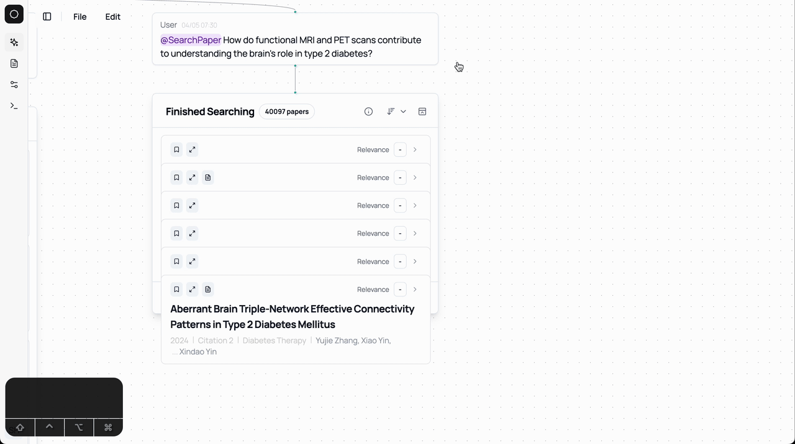
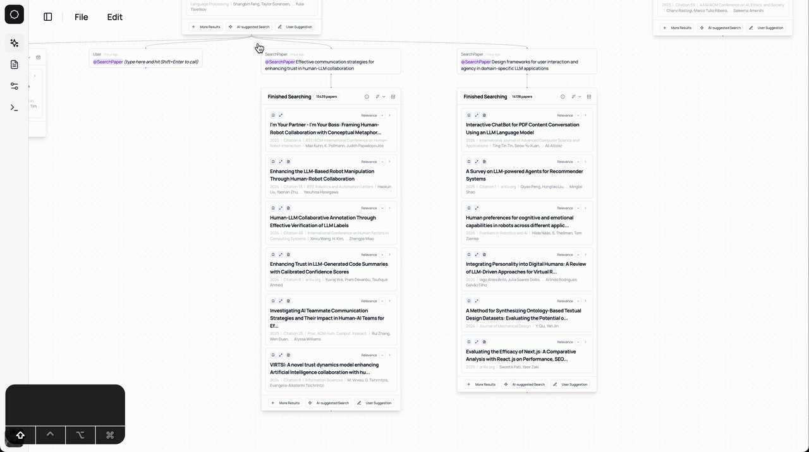

import { Collapsible, CollapsibleGroup } from '../components/Collapsible'
import Image from 'next/image'

## Usability Questions 

<Collapsible title="The paper cards are cluttered and I cannot see the content.">
  You can click the button that can sort the paper cards and it can rearrange the paper cards. 

  
</Collapsible>

<Collapsible title="How to delete a search result?">
  You can drag and select a complete paper collection node and remove the search results. 
  Depending on [the navigation mode](/features/canvas#navigating-the-canvas), you can hold shift and drag your mouse to select the paper collection node. And you can hit `delete` to remove the search result. 

  
</Collapsible>

