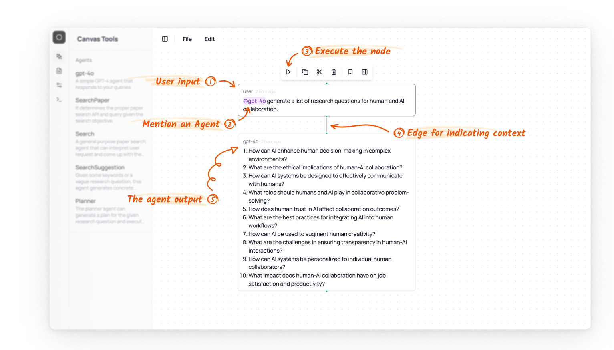

# Agent

In Lit Canvas, Agents are powered by an LLM that can interpret users' natural language queries and take proper actions for searching for papers.

The simplest agent is just the typical chat agent:

After [creating a node](./canvas/node#creating-a-new-node) in the canvas, you can type `@` to mention an agent (i.e., selecting a name from the dropdown),[^1] with your input prompt. Then you can hit `Shift + Enter` or click the button in the node control to execute the agent. The chat agent is configured to create another node and it uses a language model (gpt-4o this case) to generate a response and add it in the node.

[^1]: If you create the agent by dragging it from the left sidebar, the agent name will automatically be mentioned in the node.