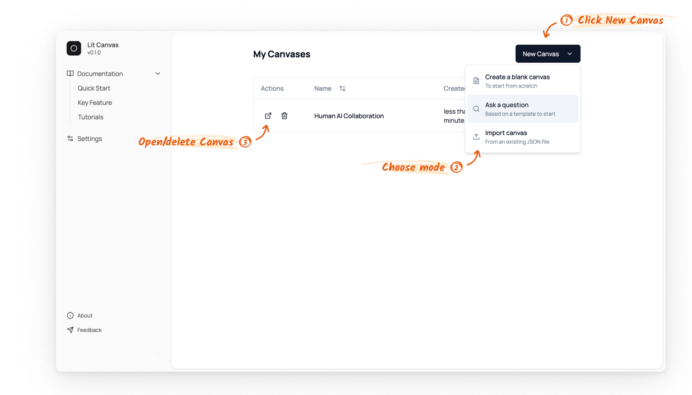
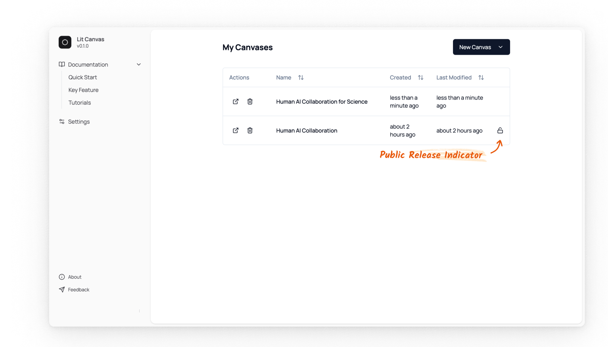

import { Callout } from 'nextra/components'

## Canvas management 

When you first log in to Lit Canvas, you'll see a dashboard displaying your canvases.
You can create a new canvas by clicking the `New Canvas` button.

Three options are available:
1. **Blank Canvas**: Start with an empty workspace
2. **Ask a Question**: Create a canvas with a question paired with the Search Agent
3. **Import**: Upload an existing canvas from a JSON file

<Callout type="warning">
    Public Release Indicator.

    A canvas marked with a public release indicator means its data may be anonymously released for research purposes if you consent. For more information or to opt out, please refer to our [research data release documentation](/data_release).
</Callout>

