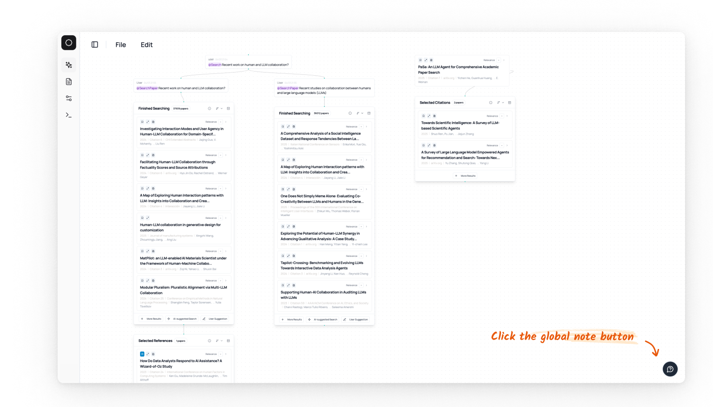
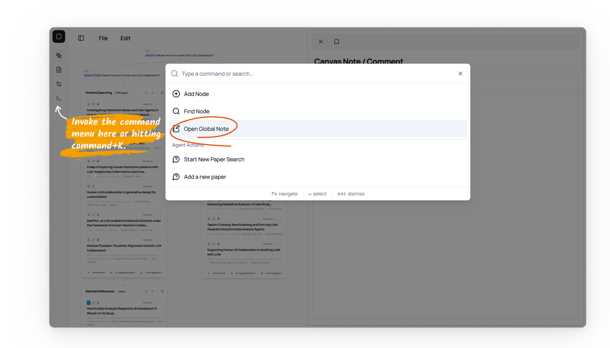
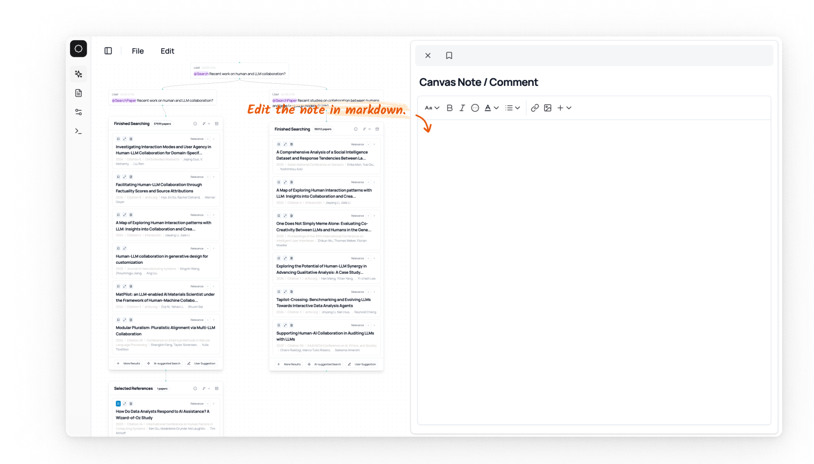

# Canvas Note 

You can add a canvas-level note as for summaries, comments, or any other information you want to add to the canvas.

You can open the note by clicking the note button on the bottom right of the canvas, or through the command menu: 

| Open in the canvas | Open via the command menu |
|--------------------|--------------------------|
|  |  |

And you can write the note im the markdown format and it will be saved automatically when you close the side panel. 

