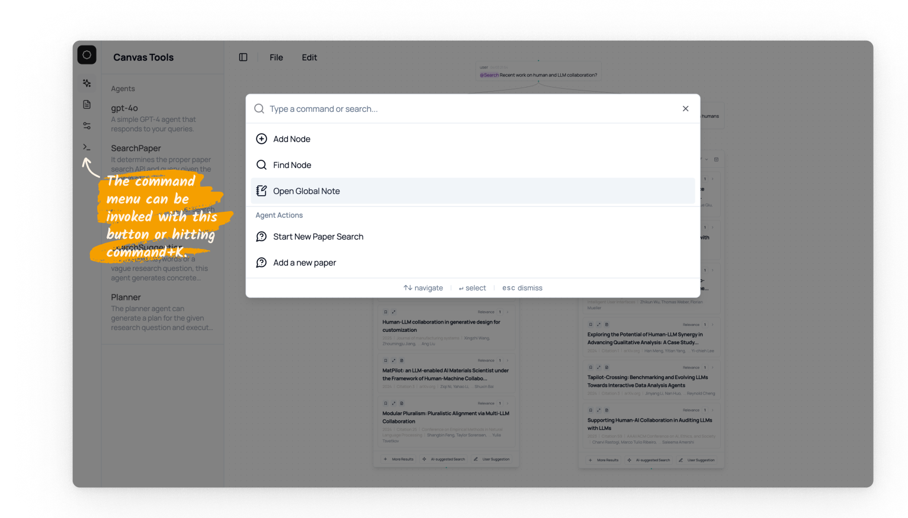

# Command Menu 

The command manu offers a quick way for navigating the canvas or invoking quick commands. It can be activated with `Cmd/Ctrl + K` or by clicking the command menu icon in the left sidebar of the canvas.
We support the following actions:

| Action | Description |
|--------|-------------|
| `Add Node` | Create a new node. |
| `Find Node` | It allows you to search for different types of nodes on the canvas and jump to them. |
| `Start New Paper Search` | Start a new paper search thread with the question that you have. | 
| `Add a new paper` | Add a new paper to the canvas. |