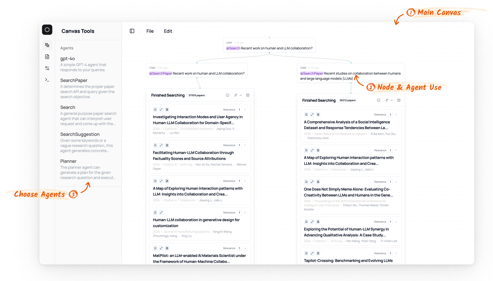
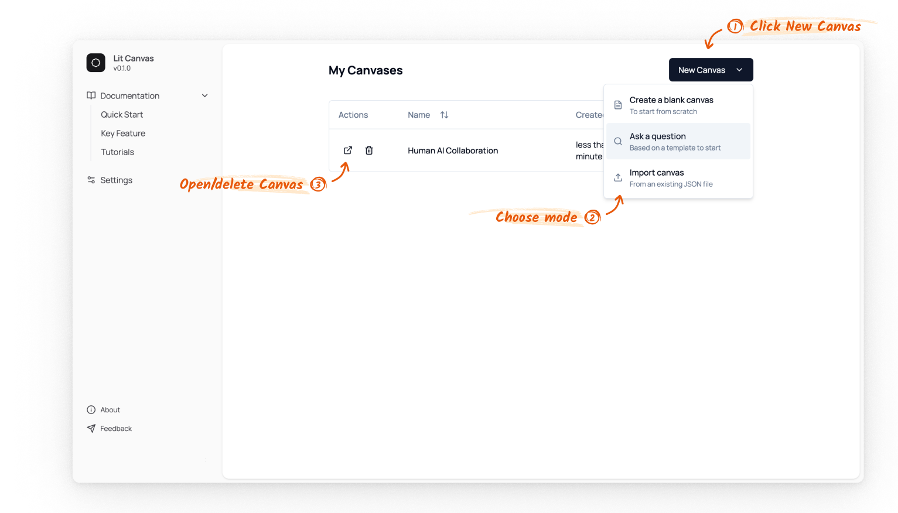
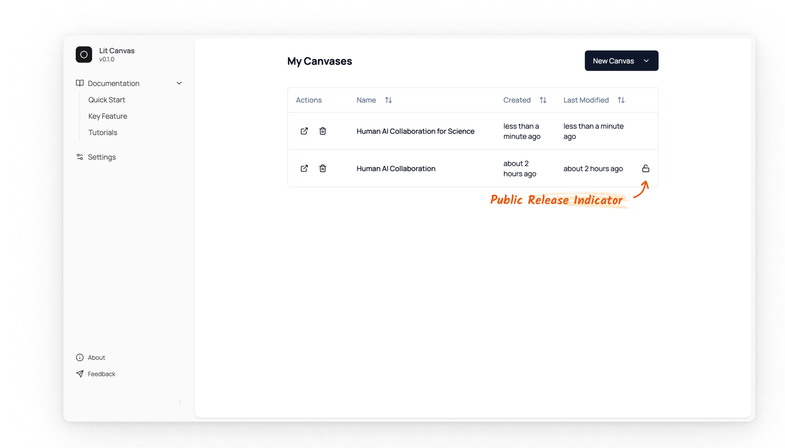

import { Callout } from 'nextra/components'
import Image from 'next/image'

# Canvas 

Canvas is the main area for the user and LLM agents to interact and collaborate for searches. 
The most important feature is that it allows for a non-linear trace of interaction, and you can branch out at an point to explore a different trajectory of searches.

## Navigating the canvas 

The default navigation controls are similar to Google Maps:

* **Pan**: Click and drag with left mouse button
* **Zoom**: Mouse scroll wheel
* **Select**: Shift + drag to create selection box

<Callout type="info">
    We also support a Figma-like Navigation mode.

    You can switch the navigation mode by go to the Settings Menu: `Settings > Canvas Settings > Navigation Mode` and change the mode to `figma`. 
    * **Pan**: Space + drag, scroll wheel, or middle/right mouse button
    * **Zoom**: Pinch gesture or Cmd/Ctrl + scroll
    * **Select**: Drag directly (no modifier key needed)
</Callout>

## Canvas management 

When you first log in to Lit Canvas, you'll see a dashboard displaying your canvases.
You can create a new canvas by clicking the `New Canvas` button.

Three options are available:
1. **Blank Canvas**: Start with an empty workspace
2. **Ask a Question**: Create a canvas with a question paired with the Search Agent
3. **Import**: Upload an existing canvas from a JSON file

<Callout type="warning">
    Public Release Indicator.

    A canvas marked with a public release indicator means its data may be anonymously released for research purposes if you consent. For more information or to opt out, please refer to our [research data release documentation](/data_release).
</Callout>

