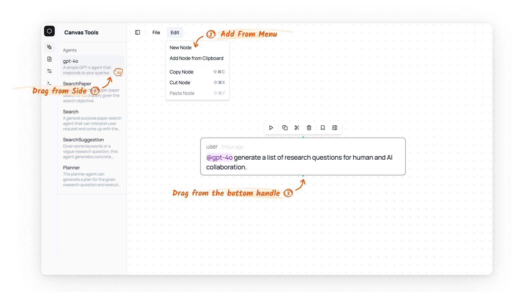

# Node 

`Node` is the basic element of the canvas. Each node is either created by the user or the agent, and it represents an action (e.g., agent use and prompts) or static content (e.g., paper information). 

## Creating a new node 

There are three ways to create a new node: 

1. Drag a node from the left sidebar.
    1. If the node "hits" some other node, then it will automatically connect to the other node.
2. Click Edit > New Node.
3. Drag a node from the bottom handle of the nodes.

## Edges 

Nodes can be connected with `edge`s. In Lit Canvas, nodes connected with edges is used to construct the context for the successor nodes. 

## Different Types of Nodes 

There are different types of nodes, and they provide different types of interactivity. See the details below. 