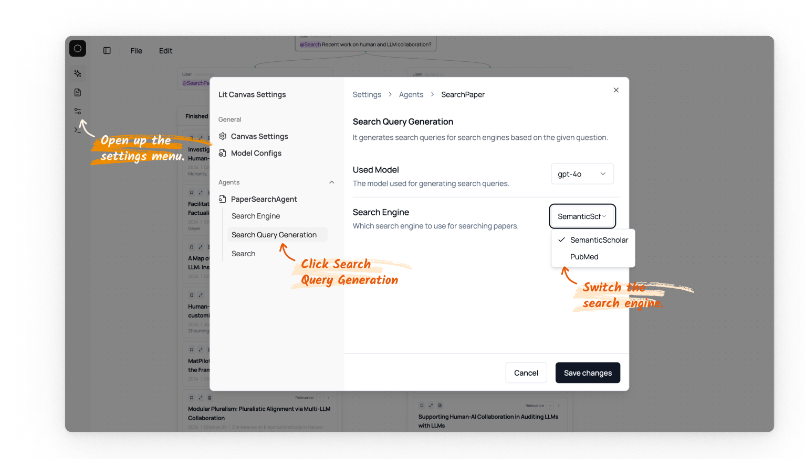

# Search Engine 

By default we use semantic scholar as the paper search engine, which has good indexing for computer science related papers. 

Alternative, PubMed often does a better job for searching biomedical papers. In this case, you can switch the searching engine following the steps below: 

