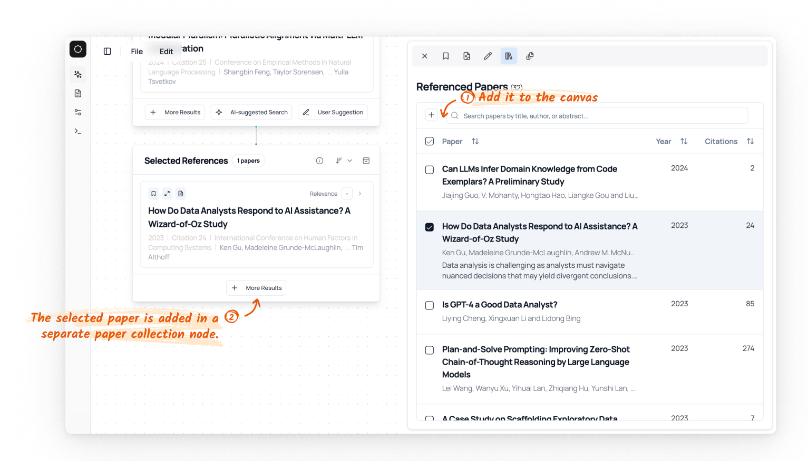

# Paper References and Citations 

Lit Canvas can load the references (papers that are cited by the current paper) citations (papers that cite the current paper) of a paper from Semantic Scholar. You can switch to the citations/references tab in the side panel.

## References

One helpful feature is that you can add any paper of interest from the list into the canvas: 

## Citations

For citations, it provides the similar feature as references: 

