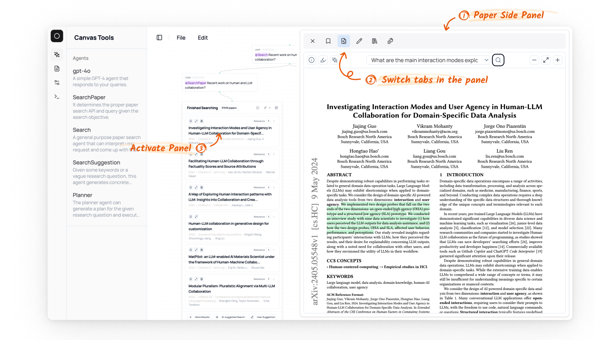

# Side Panel 

The side panel is an overlay that appears on the right side of the canvas, providing detailed information about selected nodes. 

You can access it by clicking any node on the canvas. Each panel contains multiple tabs, each offering different information for the node and supports browsing and interaction with the content.

