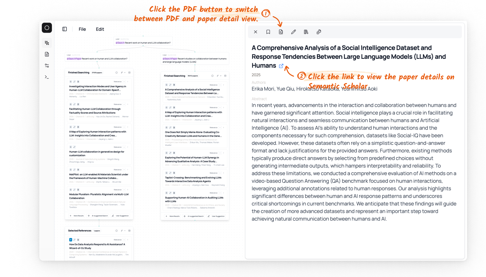

# Paper Detail Page 

We also provide a detailed view of the metadata for a paper -- the title, authors, abstract, venue (if we have the data), and the citation count. 

After clicking the paper title, it will navigate to the Semantic Scholar page for the paper, which might contain more information of the paper (as well as any external PDF link if available).