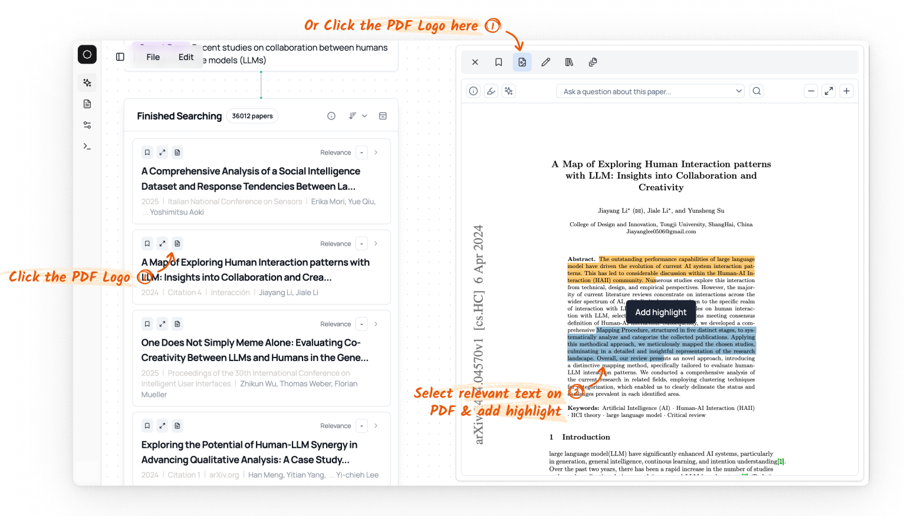
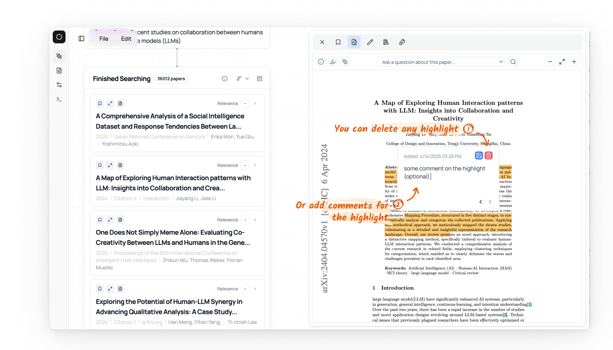

# PDF Reader

For some papers, we can have a publicly available PDF. In this case, we provide a PDF reader in the side panel for reading and highlighting the PDF. 

1. You can directly click the PDF logo in the paper card to open the PDF reader; also on the side panel, you can click the PDF logo to switch to the PDF reader.
2. You can select a span of the text in the PDF and highlight it and the highlighted text will be saved.

For the highlighted, you can add comments or remove the highlights:

